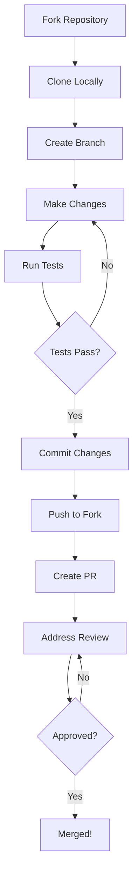

# Contributing

Thank you for your interest in contributing to these projects! This guide covers
how to contribute effectively.

## Code of Conduct

Please be respectful and constructive in all interactions. We're all here to learn
and build great things together.

## Getting Started

### 1. Fork the Repository

1. Navigate to the repository on GitHub
2. Click the "Fork" button
3. Clone your fork locally:
   ```bash
   git clone https://github.com/YOUR_USERNAME/REPO_NAME.git
   cd REPO_NAME
   ```

### 2. Set Up Development Environment

Follow the [Getting Started Guide](guides/getting-started.md) to set up your environment.

### 3. Create a Branch

```bash
# Ensure you're on main
git checkout main
git pull origin main

# Create a feature branch
git checkout -b feature/your-feature-name
```

## Making Changes

### Code Style

All projects follow consistent code style guidelines:

=== "TypeScript"

    - Use Biome for formatting and linting
    - Run `pnpm run lint` before committing
    - Prefer functional patterns
    - Use strict TypeScript settings

=== "Python"

    - Use Ruff for formatting and linting
    - Run `ruff check . && ruff format .` before committing
    - Follow PEP 8 guidelines
    - Add type hints to all functions

=== "Go"

    - Use `gofmt` and `golangci-lint`
    - Run `make lint` before committing
    - Follow effective Go guidelines

=== "Terraform"

    - Use `terraform fmt -recursive`
    - Run `tflint` before committing
    - Follow Terraform best practices

### Commit Messages

We use [Conventional Commits](https://www.conventionalcommits.org/):

```
<type>(<scope>): <description>

[optional body]

[optional footer(s)]
```

**Types:**

| Type | When to Use |
|------|-------------|
| `feat` | New feature |
| `fix` | Bug fix |
| `docs` | Documentation only |
| `style` | Formatting, no code change |
| `refactor` | Code change that doesn't fix a bug or add a feature |
| `test` | Adding or updating tests |
| `chore` | Maintenance tasks |

**Examples:**

```bash
git commit -m "feat(lambda): add SQS event source support"
git commit -m "fix(iam): correct policy attachment order"
git commit -m "docs: update installation instructions"
```

### Testing

Always add or update tests for your changes:

```bash
# TypeScript
pnpm test

# Python
pytest

# Go
go test ./...

# Terraform
terraform validate
```

## Submitting Changes

### 1. Push Your Changes

```bash
git push origin feature/your-feature-name
```

### 2. Create a Pull Request

1. Go to the repository on GitHub
2. Click "Compare & pull request"
3. Fill out the PR template:

```markdown
## Description

Brief description of changes.

## Type of Change

- [ ] Bug fix
- [ ] New feature
- [ ] Breaking change
- [ ] Documentation update

## How Has This Been Tested?

Describe the testing you performed.

## Checklist

- [ ] My code follows the project style guidelines
- [ ] I have performed a self-review
- [ ] I have added tests that prove my fix/feature works
- [ ] New and existing tests pass
- [ ] I have updated documentation as needed
```

### 3. Respond to Review

- Address all feedback constructively
- Push additional commits to your branch
- Request re-review when ready

## Types of Contributions

### Bug Reports

Open an issue with:

- Clear title describing the bug
- Steps to reproduce
- Expected vs actual behavior
- Environment details
- Screenshots or logs if applicable

### Feature Requests

Open an issue with:

- Clear description of the feature
- Use cases and benefits
- Any implementation ideas
- Willingness to contribute

### Documentation

Documentation improvements are always welcome:

- Fix typos and grammar
- Add examples
- Clarify confusing sections
- Add troubleshooting tips

### Code Contributions

- Bug fixes
- New features (discuss first in an issue)
- Performance improvements
- Test coverage improvements

## Development Workflow



## Questions?

- Check existing issues and discussions
- Open a new issue for questions
- Be patient - maintainers volunteer their time

## Recognition

Contributors are recognized in:

- The project's CHANGELOG
- GitHub's contributor graph
- Release notes when applicable

Thank you for contributing! 🎉
