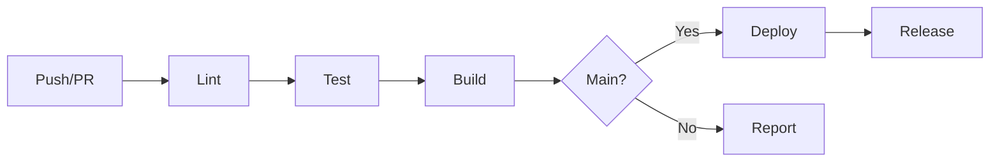

# CI/CD Best Practices

Setting up and optimizing continuous integration and deployment pipelines
with GitHub Actions for all projects.

## Overview

All projects use GitHub Actions for CI/CD with these common goals:

- **Fast feedback** - Know if something is broken quickly
- **Consistent builds** - Same result locally and in CI
- **Automated releases** - No manual version bumping
- **Security scanning** - Catch vulnerabilities early

## Workflow Structure

### Standard Pipeline



### Workflow Organization

```text
.github/
├── workflows/
│   ├── ci.yml           # Main CI pipeline
│   ├── release.yml      # Release automation
│   ├── security.yml     # Security scanning
│   └── deploy.yml       # Deployment (if separate)
├── actions/
│   └── setup/           # Reusable setup action
└── dependabot.yml       # Dependency updates
```

## GitHub Actions Basics

### Workflow Syntax

```yaml
name: CI

on:
  push:
    branches: [main]
  pull_request:
    branches: [main]

permissions:
  contents: read

jobs:
  build:
    runs-on: ubuntu-latest
    steps:
      - uses: actions/checkout@v4

      - name: Setup Node.js
        uses: actions/setup-node@v4
        with:
          node-version: "20"
          cache: "pnpm"

      - name: Install dependencies
        run: pnpm install

      - name: Run tests
        run: pnpm test
```

### Key Concepts

| Concept | Description |
|---------|-------------|
| **Workflow** | YAML file defining the automation |
| **Job** | Set of steps running on same runner |
| **Step** | Individual task (action or command) |
| **Action** | Reusable unit of code |
| **Runner** | Server that executes the workflow |

## Language-Specific Pipelines

### TypeScript/Node.js

```yaml
name: CI

on:
  push:
    branches: [main]
  pull_request:

jobs:
  build:
    runs-on: ubuntu-latest
    steps:
      - uses: actions/checkout@v4

      - name: Setup pnpm
        uses: pnpm/action-setup@v2
        with:
          version: 8

      - name: Setup Node.js
        uses: actions/setup-node@v4
        with:
          node-version: "20"
          cache: "pnpm"

      - name: Install dependencies
        run: pnpm install --frozen-lockfile

      - name: Lint
        run: pnpm run lint

      - name: Type check
        run: pnpm run typecheck

      - name: Test
        run: pnpm test -- --coverage

      - name: Build
        run: pnpm run build

      - name: Upload coverage
        uses: codecov/codecov-action@v4
        with:
          token: ${{ secrets.CODECOV_TOKEN }}
```

### Python

```yaml
name: CI

on:
  push:
    branches: [main]
  pull_request:

jobs:
  build:
    runs-on: ubuntu-latest
    strategy:
      matrix:
        python-version: ["3.11", "3.12"]

    steps:
      - uses: actions/checkout@v4

      - name: Set up Python ${{ matrix.python-version }}
        uses: actions/setup-python@v5
        with:
          python-version: ${{ matrix.python-version }}

      - name: Install uv
        run: pip install uv

      - name: Install dependencies
        run: uv pip install -r requirements.txt --system

      - name: Lint with Ruff
        run: |
          ruff check .
          ruff format --check .

      - name: Type check with mypy
        run: mypy src/

      - name: Test with pytest
        run: pytest --cov=src --cov-report=xml

      - name: Upload coverage
        uses: codecov/codecov-action@v4
```

### Go

```yaml
name: CI

on:
  push:
    branches: [main]
  pull_request:

jobs:
  build:
    runs-on: ubuntu-latest
    steps:
      - uses: actions/checkout@v4

      - name: Set up Go
        uses: actions/setup-go@v5
        with:
          go-version: "1.24"

      - name: Verify dependencies
        run: go mod verify

      - name: Lint
        uses: golangci/golangci-lint-action@v4
        with:
          version: latest

      - name: Test
        run: go test -race -coverprofile=coverage.out ./...

      - name: Build
        run: go build -v ./...

      - name: Upload coverage
        uses: codecov/codecov-action@v4
```

### Terraform

```yaml
name: Terraform

on:
  push:
    branches: [main]
  pull_request:

jobs:
  terraform:
    runs-on: ubuntu-latest
    steps:
      - uses: actions/checkout@v4

      - name: Setup Terraform
        uses: hashicorp/setup-terraform@v3
        with:
          terraform_version: "1.7"

      - name: Terraform Format
        run: terraform fmt -check -recursive

      - name: Terraform Init
        run: terraform init -backend=false

      - name: Terraform Validate
        run: terraform validate

      - name: TFLint
        uses: terraform-linters/setup-tflint@v4
        with:
          tflint_version: latest

      - name: Run TFLint
        run: tflint --recursive
```

## Security Scanning

### Comprehensive Security Pipeline

```yaml
name: Security

on:
  push:
    branches: [main]
  pull_request:
  schedule:
    - cron: "0 0 * * 0"  # Weekly

jobs:
  security:
    runs-on: ubuntu-latest
    steps:
      - uses: actions/checkout@v4

      # Secret scanning
      - name: Gitleaks
        uses: gitleaks/gitleaks-action@v2
        env:
          GITHUB_TOKEN: ${{ secrets.GITHUB_TOKEN }}

      # Dependency scanning
      - name: Dependency Review
        uses: actions/dependency-review-action@v4
        if: github.event_name == 'pull_request'

      # SAST for Terraform
      - name: tfsec
        uses: aquasecurity/tfsec-action@v1.0.3
        with:
          soft_fail: true

      # Container scanning
      - name: Trivy
        uses: aquasecurity/trivy-action@master
        with:
          scan-type: "fs"
          ignore-unfixed: true
          severity: "CRITICAL,HIGH"

      # IaC scanning
      - name: Checkov
        uses: bridgecrewio/checkov-action@v12
        with:
          directory: .
          quiet: true
          soft_fail: true
```

## Release Automation

### Semantic Release

```yaml
name: Release

on:
  push:
    branches: [main]

permissions:
  contents: write
  issues: write
  pull-requests: write

jobs:
  release:
    runs-on: ubuntu-latest
    steps:
      - uses: actions/checkout@v4
        with:
          fetch-depth: 0
          persist-credentials: false

      - name: Setup Node.js
        uses: actions/setup-node@v4
        with:
          node-version: "20"

      - name: Install dependencies
        run: npm install -g semantic-release @semantic-release/changelog @semantic-release/git

      - name: Release
        env:
          GITHUB_TOKEN: ${{ secrets.GITHUB_TOKEN }}
        run: npx semantic-release
```

### Release Configuration

```json
// .releaserc.json
{
  "branches": ["main"],
  "plugins": [
    "@semantic-release/commit-analyzer",
    "@semantic-release/release-notes-generator",
    ["@semantic-release/changelog", {
      "changelogFile": "CHANGELOG.md"
    }],
    ["@semantic-release/git", {
      "assets": ["CHANGELOG.md", "package.json"],
      "message": "chore(release): ${nextRelease.version} [skip ci]"
    }],
    "@semantic-release/github"
  ]
}
```

## Deployment

### AWS Lambda Deployment

```yaml
name: Deploy

on:
  release:
    types: [published]

permissions:
  id-token: write
  contents: read

jobs:
  deploy:
    runs-on: ubuntu-latest
    environment: production
    steps:
      - uses: actions/checkout@v4

      - name: Configure AWS Credentials
        uses: aws-actions/configure-aws-credentials@v4
        with:
          role-to-assume: ${{ secrets.AWS_ROLE_ARN }}
          aws-region: us-east-1

      - name: Build Lambda
        run: make build

      - name: Deploy Lambda
        run: |
          aws lambda update-function-code \
            --function-name my-function \
            --zip-file fileb://lambda.zip
```

### GitHub Pages Deployment

```yaml
name: Deploy Docs

on:
  push:
    branches: [main]
    paths:
      - "docs/**"
      - "mkdocs.yml"

permissions:
  contents: read
  pages: write
  id-token: write

jobs:
  deploy:
    runs-on: ubuntu-latest
    environment:
      name: github-pages
      url: ${{ steps.deployment.outputs.page_url }}
    steps:
      - uses: actions/checkout@v4

      - name: Setup Python
        uses: actions/setup-python@v5
        with:
          python-version: "3.12"

      - name: Install MkDocs
        run: pip install mkdocs-material mkdocs-minify-plugin

      - name: Build docs
        run: mkdocs build

      - name: Setup Pages
        uses: actions/configure-pages@v4

      - name: Upload artifact
        uses: actions/upload-pages-artifact@v3
        with:
          path: site

      - name: Deploy to GitHub Pages
        id: deployment
        uses: actions/deploy-pages@v4
```

## Optimization Tips

### Caching

```yaml
# Node.js caching
- uses: actions/setup-node@v4
  with:
    node-version: "20"
    cache: "pnpm"

# Python caching
- uses: actions/setup-python@v5
  with:
    python-version: "3.12"
    cache: "pip"

# Go caching
- uses: actions/setup-go@v5
  with:
    go-version: "1.24"
    cache: true

# Custom caching
- uses: actions/cache@v4
  with:
    path: ~/.cache/custom
    key: ${{ runner.os }}-custom-${{ hashFiles('**/lockfile') }}
```

### Parallel Jobs

```yaml
jobs:
  lint:
    runs-on: ubuntu-latest
    steps:
      - run: npm run lint

  test:
    runs-on: ubuntu-latest
    steps:
      - run: npm test

  build:
    needs: [lint, test]  # Runs after both complete
    runs-on: ubuntu-latest
    steps:
      - run: npm run build
```

### Matrix Builds

```yaml
jobs:
  test:
    strategy:
      matrix:
        os: [ubuntu-latest, macos-latest, windows-latest]
        node: [18, 20, 22]
        exclude:
          - os: macos-latest
            node: 18
    runs-on: ${{ matrix.os }}
    steps:
      - uses: actions/setup-node@v4
        with:
          node-version: ${{ matrix.node }}
```

### Conditional Steps

```yaml
steps:
  - name: Deploy to production
    if: github.ref == 'refs/heads/main'
    run: ./deploy.sh

  - name: Deploy to staging
    if: github.ref == 'refs/heads/develop'
    run: ./deploy.sh staging
```

## Gotchas & Tips

!!! warning "Secret Management"
    Never hardcode secrets. Use GitHub Secrets and environment variables.
    ```yaml
    env:
      API_KEY: ${{ secrets.API_KEY }}
    ```

!!! tip "Branch Protection"
    Enable branch protection rules requiring:

    - Pull request before merging
    - Status checks to pass
    - Up-to-date branches

!!! note "Permissions"
    Use minimal permissions. Default to `contents: read` and add only what's needed.

!!! warning "Workflow Runs"
    Be mindful of workflow runs - they count against your Actions minutes.
    Use path filters to avoid unnecessary runs:
    ```yaml
    on:
      push:
        paths:
          - "src/**"
          - "tests/**"
        paths-ignore:
          - "**.md"
    ```

## Debugging

### Enable Debug Logging

```yaml
# In workflow
env:
  ACTIONS_STEP_DEBUG: true
  ACTIONS_RUNNER_DEBUG: true

# Or set repository secrets
ACTIONS_STEP_DEBUG: true
```

### Local Testing with act

```bash
# Install act
brew install act

# Run workflow locally
act push

# Run specific job
act -j build

# With secrets
act --secret-file .secrets
```

## Resources

- [GitHub Actions Documentation](https://docs.github.com/en/actions)
- [Awesome Actions](https://github.com/sdras/awesome-actions)
- [Act - Local Testing](https://github.com/nektos/act)
- [Semantic Release](https://semantic-release.gitbook.io/)
