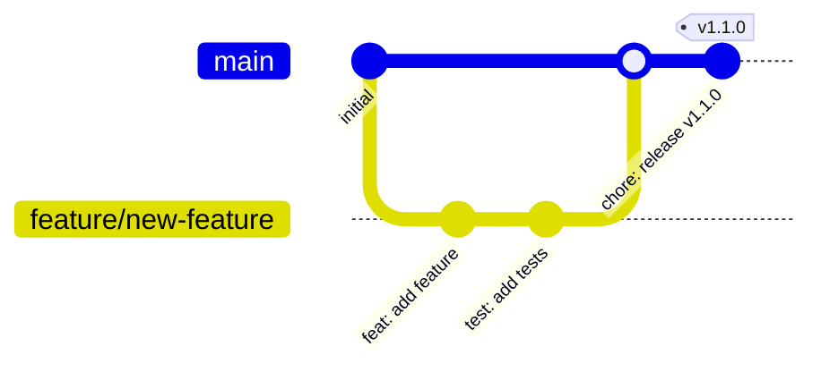
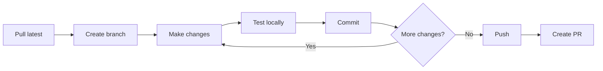

# Development Workflows

Best practices for branching, commits, code review, and collaborative development
across all projects.

## Git Workflow

### Branch Strategy

We use a simplified Git Flow approach:



### Branch Naming

| Type | Pattern | Example |
|------|---------|---------|
| Feature | `feature/description` | `feature/add-sqs-support` |
| Bug Fix | `fix/description` | `fix/memory-leak` |
| Hotfix | `hotfix/description` | `hotfix/security-patch` |
| Release | `release/version` | `release/1.2.0` |
| Docs | `docs/description` | `docs/update-readme` |

### Creating a Branch

```bash
# Ensure you're on main and up to date
git checkout main
git pull origin main

# Create and switch to new branch
git checkout -b feature/my-new-feature

# Push branch to remote
git push -u origin feature/my-new-feature
```

## Commit Conventions

### Conventional Commits

All projects use [Conventional Commits](https://www.conventionalcommits.org/):

```
<type>(<scope>): <description>

[optional body]

[optional footer(s)]
```

### Types

| Type | Description | Example |
|------|-------------|---------|
| `feat` | New feature | `feat(api): add user authentication` |
| `fix` | Bug fix | `fix(parser): handle empty input` |
| `docs` | Documentation | `docs: update installation guide` |
| `style` | Formatting | `style: fix indentation` |
| `refactor` | Code refactoring | `refactor: simplify handler logic` |
| `test` | Adding tests | `test: add unit tests for parser` |
| `chore` | Maintenance | `chore: update dependencies` |
| `ci` | CI/CD changes | `ci: add security scanning` |
| `perf` | Performance | `perf: optimize database queries` |

### Examples

=== "Feature"

    ```
    feat(lambda): add SQS event source support

    - Add SQS event source mapping
    - Configure batch size and visibility timeout
    - Add dead letter queue support

    Closes #123
    ```

=== "Bug Fix"

    ```
    fix(iam): correct policy attachment order

    The IAM policy was being attached before the role was created,
    causing deployment failures.

    Fixes #456
    ```

=== "Breaking Change"

    ```
    feat(api)!: change response format

    BREAKING CHANGE: The API now returns responses in a new format.
    Migration guide: https://docs.example.com/migration

    - Old: { data: [] }
    - New: { items: [], meta: {} }
    ```

### Commit Best Practices

!!! tip "Atomic Commits"
    Each commit should represent a single logical change.
    If you can describe your commit with "and", split it up.

!!! warning "Don't Commit"
    - Credentials or secrets
    - Large binary files
    - IDE settings (unless shared)
    - Build artifacts

## Code Review

### Pull Request Template

```markdown
## Description

Brief description of changes.

## Type of Change

- [ ] Bug fix
- [ ] New feature
- [ ] Breaking change
- [ ] Documentation update

## How Has This Been Tested?

- [ ] Unit tests
- [ ] Integration tests
- [ ] Manual testing

## Checklist

- [ ] My code follows the project style guidelines
- [ ] I have performed a self-review
- [ ] I have commented my code where necessary
- [ ] I have updated the documentation
- [ ] My changes generate no new warnings
- [ ] I have added tests for my changes
- [ ] All new and existing tests pass
```

### Review Guidelines

**As a Reviewer:**

1. **Be constructive** - Focus on the code, not the person
2. **Ask questions** - Understand before suggesting changes
3. **Prioritize** - Distinguish blocking issues from suggestions
4. **Be timely** - Review within 24-48 hours

**As an Author:**

1. **Keep PRs small** - Easier to review and merge
2. **Provide context** - Explain why, not just what
3. **Self-review first** - Catch obvious issues
4. **Respond promptly** - Keep the conversation moving

### Review Comments

Use prefixes to indicate severity:

| Prefix | Meaning | Required |
|--------|---------|----------|
| `blocking:` | Must be fixed before merge | Yes |
| `suggestion:` | Consider this change | No |
| `nit:` | Minor style/preference | No |
| `question:` | Need clarification | Maybe |

Example:
```
blocking: This SQL query is vulnerable to injection. Use parameterized queries.

suggestion: Consider using a constant for this magic number.

nit: Extra whitespace on line 42.

question: Why did we choose this approach over X?
```

## Development Cycle

### Daily Workflow



### Before Starting Work

```bash
# Update main branch
git checkout main
git pull origin main

# Check for any open PRs you should review
gh pr list --reviewer @me

# Create your feature branch
git checkout -b feature/my-feature
```

### During Development

```bash
# Make changes and test
npm test  # or make test, pytest, etc.

# Stage and commit
git add .
git commit -m "feat: add new feature"

# Keep branch updated with main
git fetch origin
git rebase origin/main
```

### Submitting Changes

```bash
# Push your branch
git push origin feature/my-feature

# Create pull request
gh pr create --title "feat: add new feature" --body "Description of changes"

# Or use GitHub UI
```

## Pre-commit Hooks

All projects use pre-commit hooks for quality checks.

### Installation

```bash
# Install pre-commit
pip install pre-commit

# Or with brew
brew install pre-commit

# Install hooks in repository
pre-commit install
```

### Common Hooks

```yaml
# .pre-commit-config.yaml
repos:
  - repo: https://github.com/pre-commit/pre-commit-hooks
    rev: v4.5.0
    hooks:
      - id: trailing-whitespace
      - id: end-of-file-fixer
      - id: check-yaml
      - id: check-json
      - id: check-merge-conflict

  - repo: https://github.com/astral-sh/ruff-pre-commit
    rev: v0.3.0
    hooks:
      - id: ruff
        args: [--fix]
      - id: ruff-format

  - repo: https://github.com/biomejs/pre-commit
    rev: v0.1.0
    hooks:
      - id: biome-check
```

### Running Hooks Manually

```bash
# Run all hooks on all files
pre-commit run --all-files

# Run specific hook
pre-commit run ruff --all-files

# Skip hooks (use sparingly)
git commit --no-verify -m "message"
```

## Handling Conflicts

### Prevention

1. Keep branches short-lived
2. Rebase frequently
3. Communicate about overlapping work

### Resolution

```bash
# Update your branch
git fetch origin
git rebase origin/main

# If conflicts occur
# 1. Open conflicted files
# 2. Look for conflict markers: <<<<<<<, =======, >>>>>>>
# 3. Choose the correct code
# 4. Remove conflict markers

# After resolving
git add <resolved-files>
git rebase --continue

# If things go wrong
git rebase --abort
```

## Release Process

### Semantic Versioning

All projects follow [Semantic Versioning](https://semver.org/):

- **MAJOR** (1.0.0): Breaking changes
- **MINOR** (0.1.0): New features, backward compatible
- **PATCH** (0.0.1): Bug fixes, backward compatible

### Automated Releases

Projects use semantic-release for automated versioning:

```yaml
# .releaserc.yml
branches:
  - main
plugins:
  - "@semantic-release/commit-analyzer"
  - "@semantic-release/release-notes-generator"
  - "@semantic-release/changelog"
  - "@semantic-release/github"
```

The release type is determined by commit messages:

| Commit Type | Release |
|-------------|---------|
| `feat:` | Minor |
| `fix:` | Patch |
| `feat!:` or `BREAKING CHANGE:` | Major |

## Best Practices Summary

1. **Keep branches short-lived** - Merge within days, not weeks
2. **Write meaningful commits** - Future you will thank you
3. **Review code promptly** - Don't let PRs stale
4. **Test before pushing** - Catch issues early
5. **Communicate** - Discuss big changes before coding
6. **Document** - Update docs with code changes
