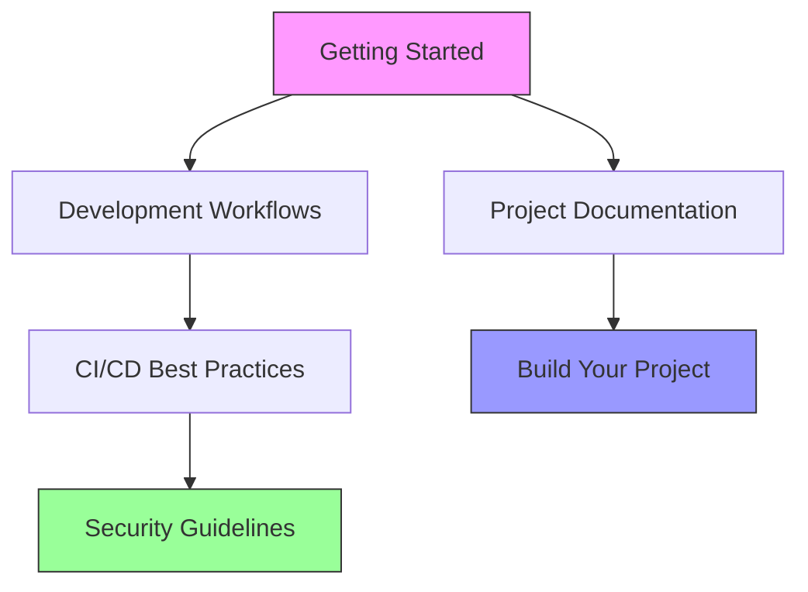

# Guides

Comprehensive guides for working with the projects in this documentation, including best
practices, workflows, and detailed tutorials.

## Available Guides

- :material-rocket-launch:{ .lg .middle } **Getting Started**

    ---

    Quick start guide for setting up your development environment and
    working with these projects.

    [:octicons-arrow-right-24: Get started](getting-started.md)

- :material-source-branch:{ .lg .middle } **Development Workflows**

    ---

    Best practices for branching, commits, code review, and collaborative
    development.

    [:octicons-arrow-right-24: Learn workflows](development-workflows.md)

- :material-pipe:{ .lg .middle } **CI/CD Best Practices**

    ---

    Setting up and optimizing continuous integration and deployment
    pipelines with GitHub Actions.

    [:octicons-arrow-right-24: Configure CI/CD](cicd-best-practices.md)

- :material-shield-lock:{ .lg .middle } **Security Guidelines**

    ---

    Security best practices for AWS, infrastructure as code, and
    application development.

    [:octicons-arrow-right-24: Secure your code](security-guidelines.md)

## Quick Links

| Guide | Best For | Time |
|-------|----------|------|
| [Getting Started](getting-started.md) | New developers | 15 min |
| [Development Workflows](development-workflows.md) | Team collaboration | 20 min |
| [CI/CD Best Practices](cicd-best-practices.md) | DevOps setup | 30 min |
| [Security Guidelines](security-guidelines.md) | Security review | 25 min |

## Prerequisites

Before diving into these guides, ensure you have:

- [x] Basic understanding of Git and GitHub
- [x] Familiarity with command-line tools
- [x] An AWS account (for AWS-related projects)
- [x] A code editor (VS Code recommended)

## Learning Path

### Recommended Order

1. **Start with Getting Started** - Set up your environment
2. **Read Development Workflows** - Understand how to contribute
3. **Explore Project Documentation** - Learn specific projects
4. **Apply CI/CD Best Practices** - Automate your workflows
5. **Follow Security Guidelines** - Secure your implementations
