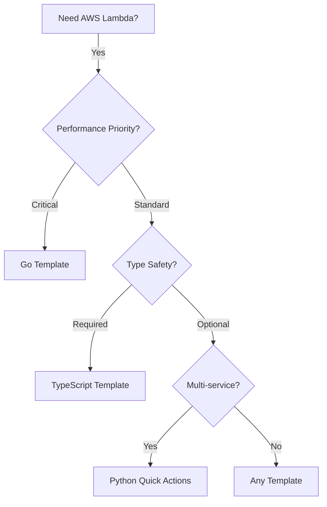

# Lambda Templates

Production-ready AWS Lambda boilerplates for TypeScript, Go, and Python. Each template includes
comprehensive tooling for development, testing, and deployment.

## Template Comparison

| Feature | TypeScript | Go | Python |
|---------|------------|-----|--------|
| **Runtime** | Node.js 20.x | provided.al2023 | Python 3.12 |
| **Package Manager** | pnpm | go modules | pip |
| **Linter** | Biome | golangci-lint | Ruff |
| **Formatter** | Biome | gofmt | Ruff |
| **Test Framework** | Vitest | Go testing | pytest |
| **Git Hooks** | Lefthook | Lefthook | pre-commit |
| **IaC** | Terraform | Terraform | Terraform |
| **CI/CD** | GitHub Actions | GitHub Actions | GitHub Actions |

## When to Use Each Template

### TypeScript Lambda Template

**Best for:**

- Complex business logic
- Type-safe event processing
- PostgreSQL/MSSQL integrations
- S3 to database pipelines

**Key Features:**

- ECMAScript Modules (ESM) with `.mts` extension
- Native ESM testing with Vitest
- Biome for linting and formatting
- CSV parsing with streaming

### Go Lambda Template

**Best for:**

- Performance-critical functions
- Minimal cold start requirements
- Memory-constrained environments
- Simple request/response handlers

**Key Features:**

- Minimal binary size with `-ldflags="-s -w"`
- Race condition detection in tests
- Comprehensive security scanning
- Multi-version testing (Go 1.23.x, 1.24.x)

### Quick Actions Lambda Template

**Best for:**

- Multi-service AWS operations
- SQS queue redriving
- ECR/ECS/Lambda management
- CloudWatch and Glue automation

**Key Features:**

- 18+ pre-built AWS actions
- Event-driven dispatch pattern
- Ruff linting and formatting
- SQS trigger integration

## Common Setup Steps

All templates follow a similar setup pattern:

```bash
# 1. Clone the template
git clone https://github.com/riyanimam/<template-name>.git
cd <template-name>

# 2. Install dependencies
# TypeScript: pnpm install
# Go: go mod download
# Python: pip install -r requirements.txt

# 3. Install git hooks
# TypeScript/Go: npx lefthook install
# Python: pre-commit install

# 4. Run tests
# TypeScript: pnpm test
# Go: go test -v ./...
# Python: pytest test/ -v

# 5. Build for Lambda
# See individual template docs for deployment commands
```

## Choosing the Right Template


