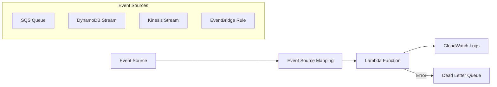

# Event-Based Terraform Module

[](https://github.com/riyanimam/event-based-terraform-module/actions/workflows/ci.yml)
[](https://www.terraform.io/)
[](https://opentofu.org/)

A comprehensive Terraform/OpenTofu module for deploying event-driven AWS Lambda functions with
support for multiple event sources including SQS, DynamoDB Streams, Kinesis Streams, and EventBridge.

[:fontawesome-brands-github: View on GitHub](https://github.com/riyanimam/event-based-terraform-module){ .md-button }

## Features

- 🚀 **Multiple Event Sources**: SQS, DynamoDB Streams, Kinesis Streams, EventBridge
- 🔒 **Security First**: Built-in security scanning with tfsec, Checkov, and Trivy
- 📊 **Observability**: CloudWatch Logs integration with configurable retention
- 🔄 **Dead Letter Queue**: Optional DLQ configuration for SQS sources
- 🏷️ **Tagging**: Comprehensive resource tagging support
- 📝 **Complete Examples**: Production-ready examples for each event source

## Architecture

This module creates a complete event-driven architecture with:

- AWS Lambda function with IAM role and policies
- Event source (SQS queue, etc.) or connection to existing source
- Event source mapping
- CloudWatch log group with configurable retention
- Optional Dead Letter Queue (DLQ)



## Requirements

- Terraform/OpenTofu >= 1.0
- AWS Provider ~> 5.0
- AWS account with appropriate permissions

## Quick Start

### Basic SQS Example

```hcl
module "sqs_lambda" {
  source = "github.com/riyanimam/event-based-terraform-module//opentofu"

  function_name      = "my-event-processor"
  lambda_runtime     = "python3.12"
  lambda_handler     = "handler.lambda_handler"
  source_code_path   = "lambda.zip"

  event_source_type   = "sqs"
  create_event_source = true

  environment_variables = {
    LOG_LEVEL = "INFO"
  }

  tags = {
    Environment = "production"
    Project     = "my-project"
  }
}
```

### Using Existing Event Source

```hcl
module "existing_sqs_lambda" {
  source = "github.com/riyanimam/event-based-terraform-module//opentofu"

  function_name      = "my-event-processor"
  lambda_runtime     = "python3.12"
  lambda_handler     = "handler.lambda_handler"
  source_code_path   = "lambda.zip"

  event_source_type   = "sqs"
  create_event_source = false
  event_source_arn    = "arn:aws:sqs:us-east-1:123456789012:my-existing-queue"

  tags = {
    Environment = "production"
  }
}
```

### DynamoDB Stream Example

```hcl
module "dynamodb_lambda" {
  source = "github.com/riyanimam/event-based-terraform-module//opentofu"

  function_name      = "dynamodb-stream-processor"
  lambda_runtime     = "python3.12"
  lambda_handler     = "handler.lambda_handler"
  source_code_path   = "lambda.zip"

  event_source_type   = "dynamodb"
  create_event_source = false
  event_source_arn    = "arn:aws:dynamodb:us-east-1:123456789012:table/MyTable/stream/..."

  starting_position = "LATEST"
  batch_size        = 100

  tags = {
    Environment = "production"
  }
}
```

## Module Inputs

| Name | Description | Type | Default | Required |
|------|-------------|------|---------|----------|
| `function_name` | Name of the Lambda function | string | - | yes |
| `lambda_runtime` | Runtime for the Lambda function | string | `"python3.12"` | no |
| `lambda_handler` | Handler for the Lambda function | string | `"handler.lambda_handler"` | no |
| `lambda_timeout` | Timeout in seconds | number | `300` | no |
| `lambda_memory_size` | Memory size in MB | number | `128` | no |
| `source_code_path` | Path to Lambda source code zip | string | - | yes |
| `event_source_type` | Type of event source | string | `"sqs"` | no |
| `event_source_arn` | ARN of existing event source | string | `null` | no |
| `create_event_source` | Whether to create event source | bool | `true` | no |
| `batch_size` | Batch size for event source mapping | number | `10` | no |
| `starting_position` | Starting position for streams | string | `"LATEST"` | no |
| `enable_dlq` | Enable Dead Letter Queue | bool | `true` | no |
| `enable_sqs_encryption` | Enable SQS encryption | bool | `true` | no |
| `kms_key_id` | KMS key for encryption | string | `null` | no |
| `environment_variables` | Lambda environment variables | map(string) | `{}` | no |
| `log_retention_days` | CloudWatch log retention | number | `14` | no |
| `tags` | Resource tags | map(string) | `{}` | no |

## Module Outputs

| Name | Description |
|------|-------------|
| `lambda_function_arn` | ARN of the Lambda function |
| `lambda_function_name` | Name of the Lambda function |
| `lambda_role_arn` | ARN of the Lambda execution role |
| `cloudwatch_log_group_name` | Name of the CloudWatch log group |
| `sqs_queue_url` | URL of the SQS queue (if created) |
| `sqs_dlq_url` | URL of the DLQ (if created) |

## Security Checklist

The module addresses these Checkov security checks:

| Check ID | Description | Status |
|----------|-------------|--------|
| CKV_AWS_50 | X-Ray tracing enabled | ✅ |
| CKV_AWS_116 | Lambda DLQ configured | ✅ |
| CKV_AWS_117 | VPC configuration support | ✅ |
| CKV_AWS_173 | Environment variable encryption | ✅ |
| CKV_AWS_272 | Code signing support | ✅ |

## CI/CD

The project includes comprehensive GitHub Actions workflows:

- **Code Quality**: Terraform fmt, validate, TFLint, Python linting with Ruff
- **Security**: tfsec, Checkov, Trivy, Gitleaks secret scanning
- **Terraform Plan**: Automatic plan generation on PRs with cost estimation
- **Integration Tests**: Deploy and test infrastructure
- **Release**: Automated versioning with semantic-release

## Gotchas & Tips

!!! warning "SQS Visibility Timeout"
    Set `sqs_visibility_timeout` to at least 6x your Lambda timeout to prevent
    message reprocessing during long executions.

!!! tip "DynamoDB Streams"
    When using DynamoDB streams, ensure your Lambda has permission to read from
    the stream. The module automatically configures this when using `event_source_type = "dynamodb"`.

!!! note "KMS Encryption"
    When using `kms_key_id`, ensure your Lambda role has `kms:Decrypt` permission.
    The module doesn't automatically add KMS permissions.

!!! warning "EventBridge Rules"
    EventBridge rules don't use event source mappings. The module creates a
    Lambda permission and CloudWatch Event target instead.

## Troubleshooting

### Lambda Not Triggered

1. Check the event source mapping is enabled:

   ```bash
   aws lambda list-event-source-mappings --function-name <name>
   ```

2. Verify IAM permissions:

   ```bash
   aws iam get-role-policy --role-name <role> --policy-name <policy>
   ```

3. Check CloudWatch Logs for errors:

   ```bash
   aws logs tail /aws/lambda/<function-name> --follow
   ```

### DLQ Not Receiving Messages

1. Verify DLQ is configured:

   ```bash
   aws sqs get-queue-attributes --queue-url <queue-url> --attribute-names All
   ```

2. Check Lambda function errors (messages go to DLQ after failed retries)

### Terraform State Issues

```bash
# Refresh state
terraform refresh

# Import existing resource
terraform import module.sqs_lambda.aws_lambda_function.event_based_lambda <name>
```

## Development

### Prerequisites

- Terraform/OpenTofu >= 1.0
- Python 3.12+
- AWS CLI configured
- pre-commit (optional but recommended)

### Local Setup

```bash
# Clone the repository
git clone https://github.com/riyanimam/event-based-terraform-module.git
cd event-based-terraform-module

# Install pre-commit hooks
pre-commit install

# Install Python dependencies (for tests)
pip install -r test/requirements.txt
```

### Testing

```bash
# Terraform validation
cd opentofu
terraform init -backend=false
terraform validate
terraform fmt -check -recursive

# Python tests
pytest test/ -v

# Integration tests (requires AWS)
pytest test/test_integration.py -v
```

### Building Lambda Packages

```bash
./src/build.sh lambda opentofu/examples/sqs-lambda/lambda lambda.zip
```

## Enhancement Ideas

- [ ] Add support for S3 event notifications
- [ ] Add support for SNS event sources
- [ ] Add CloudFormation output format
- [ ] Add Terragrunt examples
- [ ] Add multi-region deployment examples
- [ ] Add Lambda Layers support

## Resources

- [AWS Lambda Event Source Mappings](https://docs.aws.amazon.com/lambda/latest/dg/invocation-eventsourcemapping.html)
- [Terraform AWS Provider](https://registry.terraform.io/providers/hashicorp/aws/latest)
- [Checkov Documentation](https://www.checkov.io/2.Basics/Visualizing%20Checkov%20Output.html)
- [tfsec Documentation](https://aquasecurity.github.io/tfsec/)
