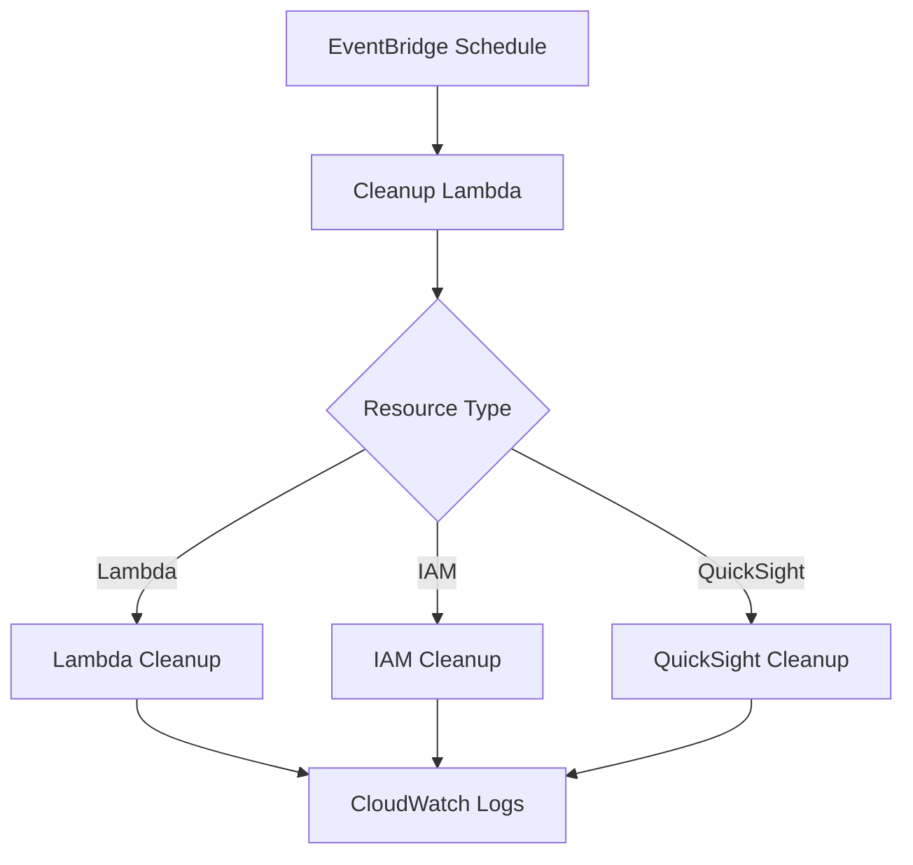

# AWS Environment Cleanup Lambda

[](https://www.python.org/)
[](https://opensource.org/licenses/MIT)
[](https://www.terraform.io/)

An automated AWS Lambda function for cleaning up unused resources across your AWS environment.
Supports cleanup of Lambda functions, IAM roles, QuickSight assets, and more.

[:fontawesome-brands-github: View on GitHub](https://github.com/riyanimam/aws-environment-cleanup-lambda){ .md-button }

## Overview

This project provides a scheduled Lambda function that automatically identifies and removes
unused AWS resources, helping to:

- **Reduce Costs**: Remove unused resources that incur charges
- **Improve Security**: Clean up orphaned IAM roles and policies
- **Maintain Hygiene**: Keep your AWS environment organized

## Features

| Feature | Description |
|---------|-------------|
| **Lambda Cleanup** | Remove unused or deprecated Lambda functions |
| **IAM Cleanup** | Clean up orphaned roles, policies, and users |
| **QuickSight Cleanup** | Remove unused dashboards, analyses, and datasets |
| **Dry Run Mode** | Preview changes without making modifications |
| **Terraform Managed** | Full infrastructure as code deployment |

## Architecture



## Project Structure

```
aws-environment-cleanup-lambda/
├── src/
│   ├── main.py              # Main Lambda handler
│   ├── lambda_cleanup.py    # Lambda resource cleanup
│   ├── iam_cleanup.py       # IAM resource cleanup
│   └── quicksight_cleanup.py # QuickSight cleanup
├── terraform/
│   ├── main.tf              # Main Terraform config
│   ├── providers.tf         # AWS provider config
│   ├── iam.tf               # IAM roles and policies
│   └── modules/
│       └── lambda/          # Lambda module
│           └── main.tf
├── LICENSE
└── README.md
```

## Installation

### Prerequisites

- AWS CLI configured with appropriate credentials
- Terraform >= 1.0
- Python 3.12+

### Deployment

1. **Clone the repository**:

   ```bash
   git clone https://github.com/riyanimam/aws-environment-cleanup-lambda.git
   cd aws-environment-cleanup-lambda
   ```

2. **Configure Terraform variables**:

   ```bash
   cd terraform
   cp terraform.tfvars.example terraform.tfvars
   # Edit terraform.tfvars with your settings
   ```

3. **Deploy with Terraform**:

   ```bash
   terraform init
   terraform plan
   terraform apply
   ```

## Configuration

### Environment Variables

| Variable | Description | Default |
|----------|-------------|---------|
| `DRY_RUN` | Enable dry-run mode (no deletions) | `true` |
| `LOG_LEVEL` | Logging verbosity | `INFO` |
| `MAX_AGE_DAYS` | Maximum age for unused resources | `90` |
| `EXCLUDED_PREFIXES` | Comma-separated prefixes to exclude | `""` |

### Terraform Variables

```hcl
variable "environment" {
  description = "Environment name"
  type        = string
  default     = "dev"
}

variable "schedule_expression" {
  description = "Schedule expression for cleanup"
  type        = string
  default     = "rate(7 days)"
}

variable "dry_run" {
  description = "Enable dry-run mode"
  type        = bool
  default     = true
}
```

## Usage

### Lambda Cleanup

The Lambda cleanup module identifies functions that:

- Have not been invoked in the specified number of days
- Match certain naming patterns (configurable)
- Are not in the excluded list

```python
# Example: Clean up Lambda functions
from lambda_cleanup import cleanup_unused_lambdas

results = cleanup_unused_lambdas(
    max_age_days=90,
    dry_run=True,
    excluded_prefixes=["prod-", "critical-"]
)

for result in results:
    print(f"{result['function_name']}: {result['action']}")
```

### IAM Cleanup

The IAM cleanup module identifies:

- Roles with no attached policies
- Policies not attached to any entity
- Unused access keys
- Outdated users

```python
# Example: Clean up IAM roles
from iam_cleanup import cleanup_orphaned_roles

results = cleanup_orphaned_roles(
    dry_run=True,
    protected_roles=["Admin", "Developer"]
)
```

### QuickSight Cleanup

The QuickSight cleanup module identifies:

- Unused dashboards
- Orphaned analyses
- Datasets with no dependencies

```python
# Example: Clean up QuickSight assets
from quicksight_cleanup import cleanup_unused_dashboards

results = cleanup_unused_dashboards(
    aws_account_id="123456789012",
    dry_run=True
)
```

## Gotchas & Tips

!!! danger "Production Safeguards"
    Always test with `DRY_RUN=true` before running in production.
    Review the CloudWatch logs carefully before disabling dry-run mode.

!!! warning "IAM Role Dependencies"
    Some IAM roles may appear unused but are required for service-linked roles
    or cross-account access. Always verify before deletion.

!!! tip "Exclusion Lists"
    Use `EXCLUDED_PREFIXES` to protect critical resources. For example:
    ```
EXCLUDED_PREFIXES=prod-,critical-,do-not-delete-
    ```

!!! note "QuickSight Permissions"
    QuickSight cleanup requires `quicksight:*` permissions and proper namespace
    configuration. Ensure your Lambda role has these permissions.

!!! warning "Lambda Concurrency"
    Be mindful of API rate limits. The cleanup Lambda uses exponential backoff,
    but large environments may need adjusted concurrency settings.

## Troubleshooting

### Lambda Not Running

1. Check EventBridge rule is enabled:

   ```bash
   aws events describe-rule --name <rule-name>
   ```

2. Verify Lambda permissions:

   ```bash
   aws lambda get-policy --function-name <function-name>
   ```

3. Check CloudWatch Logs for errors:

   ```bash
   aws logs tail /aws/lambda/<function-name> --follow
   ```

### Access Denied Errors

1. Verify IAM role has necessary permissions:

   ```bash
   aws iam get-role-policy --role-name <role-name> --policy-name <policy-name>
   ```

2. Check for resource-based policies that may block access

3. Ensure STS assume role is working:

   ```bash
   aws sts get-caller-identity
   ```

### QuickSight Errors

1. Verify QuickSight is enabled in your region:

   ```bash
   aws quicksight describe-account-subscription --aws-account-id <account-id>
   ```

2. Check namespace exists:

   ```bash
   aws quicksight list-namespaces --aws-account-id <account-id>
   ```

### Dry Run Mode Not Working

Ensure the environment variable is set correctly:

```bash
# Correct format
DRY_RUN=true

# NOT correct (case sensitive)
DRY_RUN=True
DRY_RUN=TRUE
dry_run=true
```

## Development

### Local Testing

```bash
# Install dependencies
pip install boto3 pytest pytest-mock

# Run tests
pytest tests/ -v

# Test specific module
python -c "from src.lambda_cleanup import cleanup_unused_lambdas; print(cleanup_unused_lambdas(dry_run=True))"
```

### Adding New Cleanup Modules

1. Create a new module in `src/`:

   ```python
   # src/new_service_cleanup.py
   import boto3
   import logging

   logger = logging.getLogger(__name__)

   def cleanup_new_service(dry_run: bool = True) -> list[dict]:
       """Clean up unused New Service resources."""
       client = boto3.client('new-service')
       results = []

       # Implementation here

       return results
   ```

2. Import in `main.py`:

   ```python
   from new_service_cleanup import cleanup_new_service

   def lambda_handler(event, context):
       results = cleanup_new_service(dry_run=DRY_RUN)
       # Process results
   ```

3. Update IAM permissions in `terraform/iam.tf`

## Enhancement Ideas

- [ ] Add S3 cleanup for orphaned buckets
- [ ] Add EC2 cleanup for stopped instances
- [ ] Add SNS/SQS cleanup for unused topics/queues
- [ ] Add Slack/Teams notifications for cleanup reports
- [ ] Add cost estimation for cleaned resources
- [ ] Add approval workflow for production deletions
- [ ] Add Glue cleanup for unused jobs and crawlers
- [ ] Add CloudFormation stack cleanup

## Related Projects

- [Event-Based Terraform Module](../terraform-modules/event-based-terraform-module.md) - For event-driven cleanup triggers
- [Quick Actions Lambda Template](../lambda-templates/quick-actions-aws-lambda-template.md) - Similar AWS automation patterns
