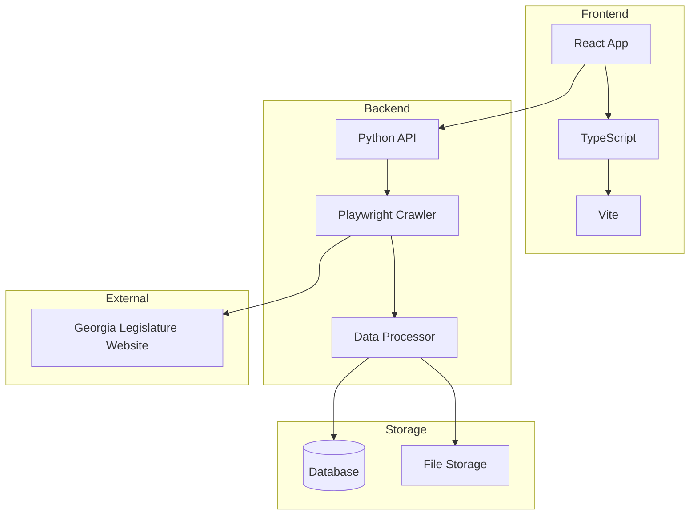

# Georgia Legislation Webcrawler

[](https://www.typescriptlang.org/)
[](https://www.python.org/)
[](https://reactjs.org/)
[](https://playwright.dev/)

A full-stack application for scraping, storing, and analyzing Georgia state legislation data.
Features a React frontend, Python backend crawler using Playwright, and comprehensive data storage.

[:fontawesome-brands-github: View on GitHub](https://github.com/riyanimam/georgia-legislation-webcrawler){ .md-button }

## Overview

This project automates the collection of Georgia legislation data, making it easier to:

- **Track Legislation**: Monitor bills and resolutions
- **Analyze Patterns**: Understand voting patterns and trends
- **Research History**: Access historical legislation data
- **Stay Informed**: Get notifications on legislation changes

## Architecture



## Features

| Component | Technology | Purpose |
|-----------|------------|---------|
| **Frontend** | React + TypeScript | User interface for viewing legislation |
| **Crawler** | Python + Playwright | Web scraping with browser automation |
| **API** | Python | Data processing and serving |
| **Storage** | Database + Files | Persistent data storage |

## Tech Stack

### Frontend

- **React 18** - Modern UI library
- **TypeScript 5** - Type-safe JavaScript
- **Vite** - Fast build tool
- **Tailwind CSS** - Utility-first styling

### Backend

- **Python 3.12** - Backend language
- **Playwright** - Browser automation for web scraping
- **FastAPI/Flask** - API framework
- **BeautifulSoup** - HTML parsing

### Infrastructure

- **Docker** - Containerization
- **AWS** - Cloud hosting (optional)

## Quick Start

### Prerequisites

- Node.js 20+
- Python 3.12+
- Playwright browsers

### Installation

1. **Clone the repository**:
   ```bash
   git clone https://github.com/riyanimam/georgia-legislation-webcrawler.git
   cd georgia-legislation-webcrawler
   ```

2. **Install frontend dependencies**:
   ```bash
   cd frontend
   npm install
   ```

3. **Install backend dependencies**:
   ```bash
   cd backend
   pip install -r requirements.txt
   playwright install chromium
   ```

4. **Start the application**:
   ```bash
   # Terminal 1 - Backend
   cd backend
   python main.py

   # Terminal 2 - Frontend
   cd frontend
   npm run dev
   ```

## Usage

### Running the Crawler

```python
from crawler import LegislationCrawler

crawler = LegislationCrawler()

# Crawl current session
bills = await crawler.crawl_session(session="2024")

# Crawl specific bill
bill = await crawler.crawl_bill(bill_number="HB 1")

# Export to JSON
await crawler.export_to_json("legislation_data.json")
```

### API Endpoints

| Endpoint | Method | Description |
|----------|--------|-------------|
| `/api/bills` | GET | List all bills |
| `/api/bills/{id}` | GET | Get specific bill |
| `/api/crawl` | POST | Trigger crawl |
| `/api/search` | GET | Search legislation |

### Frontend Features

- **Bill Search**: Search by number, title, or sponsor
- **Filtering**: Filter by session, status, type
- **Timeline**: Visual timeline of bill progress
- **Voting Records**: View voting history

## Crawler Details

### Playwright Configuration

```python
from playwright.async_api import async_playwright

async def create_browser():
    playwright = await async_playwright().start()
    browser = await playwright.chromium.launch(
        headless=True,
        args=[
            '--disable-blink-features=AutomationControlled',
            '--no-sandbox'
        ]
    )
    return browser
```

### Rate Limiting

The crawler implements respectful rate limiting:

```python
import asyncio
from random import uniform

class RateLimiter:
    def __init__(self, requests_per_second: float = 0.5):
        self.delay = 1.0 / requests_per_second

    async def wait(self):
        # Add jitter to avoid detection
        jitter = uniform(0.1, 0.5)
        await asyncio.sleep(self.delay + jitter)
```

### Data Extraction

```python
async def extract_bill_data(page) -> dict:
    return {
        "number": await page.locator(".bill-number").text_content(),
        "title": await page.locator(".bill-title").text_content(),
        "sponsor": await page.locator(".sponsor").text_content(),
        "status": await page.locator(".status").text_content(),
        "last_action": await page.locator(".last-action").text_content(),
        "votes": await extract_votes(page),
    }
```

## Gotchas & Tips

!!! warning "Website Changes"
    The Georgia Legislature website may change structure without notice.
    Monitor for scraping failures and update selectors accordingly.

!!! tip "Headless Mode"
    Use headless mode in production, but run with `headless=False` during
    development to debug selector issues.

!!! note "Session Boundaries"
    Legislative sessions typically run January-April. Data from previous
    sessions may be archived differently.

!!! warning "Rate Limiting"
    Be respectful of the source website. The default 0.5 requests/second
    should not cause issues, but monitor for 429 errors.

!!! danger "Legal Considerations"
    Ensure your use case complies with the website's terms of service.
    This tool is intended for personal research and civic engagement.

!!! tip "Playwright Debugging"
    Use Playwright's trace viewer for debugging:
    ```python
    context = await browser.new_context()
    await context.tracing.start(screenshots=True, snapshots=True)
    # ... do work ...
    await context.tracing.stop(path="trace.zip")
    ```

## Troubleshooting

### Crawler Fails to Start

1. Ensure Playwright browsers are installed:
   ```bash
   playwright install chromium
   ```

2. Check system dependencies:
   ```bash
   playwright install-deps
   ```

### Selector Not Found

1. Open the page in a real browser
2. Inspect the element structure
3. Update selector in code:
   ```python
   # Before
   await page.locator(".old-class").text_content()

   # After
   await page.locator(".new-class").text_content()
   ```

### Timeout Errors

Increase timeout for slow pages:

```python
await page.goto(url, timeout=60000)  # 60 seconds
await page.wait_for_selector(".content", timeout=30000)
```

### Data Not Saving

1. Check database connection:
   ```python
   from database import test_connection
   assert test_connection()
   ```

2. Verify write permissions for file storage

### Frontend Not Loading

1. Check CORS configuration:
   ```python
   # FastAPI example
   from fastapi.middleware.cors import CORSMiddleware

   app.add_middleware(
       CORSMiddleware,
       allow_origins=["http://localhost:5173"],
       allow_methods=["*"],
       allow_headers=["*"],
   )
   ```

## Development

### Project Structure

```
georgia-legislation-webcrawler/
├── frontend/
│   ├── src/
│   │   ├── components/
│   │   ├── hooks/
│   │   ├── pages/
│   │   └── App.tsx
│   ├── package.json
│   └── vite.config.ts
├── backend/
│   ├── crawler/
│   │   ├── __init__.py
│   │   ├── crawler.py
│   │   └── extractors.py
│   ├── api/
│   │   ├── __init__.py
│   │   └── routes.py
│   ├── main.py
│   └── requirements.txt
├── docker-compose.yml
└── README.md
```

### Testing

```bash
# Frontend tests
cd frontend
npm test

# Backend tests
cd backend
pytest tests/ -v

# Playwright tests
pytest tests/test_crawler.py -v
```

### Docker Development

```bash
# Build and run
docker-compose up --build

# Run in background
docker-compose up -d

# View logs
docker-compose logs -f
```

## Enhancement Ideas

- [ ] Add email/SMS notifications for bill updates
- [ ] Implement full-text search with Elasticsearch
- [ ] Add machine learning for bill outcome prediction
- [ ] Create mobile app with React Native
- [ ] Add support for other state legislatures
- [ ] Implement GraphQL API
- [ ] Add export to CSV/Excel
- [ ] Create visualization dashboard with D3.js

## Resources

- [Georgia General Assembly](https://www.legis.ga.gov/)
- [Playwright Documentation](https://playwright.dev/python/docs/intro)
- [React Documentation](https://react.dev/)
- [Vite Documentation](https://vitejs.dev/)
