# Not Confusing Kanban Board Template

[](https://github.com/)
[](https://opensource.org/licenses/MIT)

A simple, intuitive GitHub project template for organizing work without the confusion of complex
project boards. Designed to be straightforward and immediately usable.

[:fontawesome-brands-github: View on GitHub](https://github.com/riyanimam/not-confusing-kanban-board-template){ .md-button }

## Why This Template?

GitHub Projects can be overwhelming with its many features and configuration options.
This template provides:

- **Simplicity**: Just the essentials - Backlog, In Progress, Done
- **Clarity**: No confusing automations or views
- **Speed**: Start organizing immediately
- **Flexibility**: Easy to customize if needed

## The Problem

Complex project boards often suffer from:

| Issue | Symptom |
|-------|---------|
| **Feature Overload** | Too many columns, views, and automations |
| **Unclear Workflow** | Confusion about where items should go |
| **Setup Paralysis** | Too much configuration before starting |
| **Maintenance Burden** | Constant tweaking instead of working |

## The Solution

A minimal Kanban board with three columns:

```mermaid
flowchart LR
    A[📋 Backlog] --> B[🔄 In Progress]
    B --> C[✅ Done]
```



## Template Structure

### Columns

| Column | Purpose | When to Use |
|--------|---------|-------------|
| **📋 Backlog** | Work that needs to be done | Add new tasks here |
| **🔄 In Progress** | Work currently being done | Move here when starting |
| **✅ Done** | Completed work | Move here when finished |

### Views

| View | Type | Purpose |
|------|------|---------|
| **Board** | Kanban | Visual workflow tracking |
| **Table** | List | Quick data entry |

## Quick Start

### Using the Template

1. **Navigate to the template repository**:

   ```
   https://github.com/riyanimam/not-confusing-kanban-board-template
   ```

2. **Click "Use this template"** → "Create a new repository"

3. **Or create a new project using the template**:
   - Go to your profile/organization
   - Click "Projects" → "New project"
   - Select this template

### Creating Items

1. Open the Board view
2. Click **+ Add item** in any column
3. Enter a title
4. Optionally add details later

### Moving Items

- **Drag and drop** between columns
- Or use the **Status** field in Table view

## Best Practices

### Keep It Simple

!!! tip "The Golden Rule"
    If a task doesn't fit in Backlog, In Progress, or Done, you don't need
    more columns - you need to break down the task.

### Item Naming

Use clear, actionable titles:

=== "Good ✅"

    - "Fix login button styling"
    - "Add user authentication"
    - "Update README with examples"

=== "Bad ❌"

    - "Login issues"
    - "Auth stuff"
    - "Docs"

### WIP Limits

Consider limiting "In Progress" items:

!!! warning "Work In Progress"
    Limit In Progress to 3-5 items. Too many items in progress means
    nothing gets finished.

### Regular Reviews

- **Daily**: Check In Progress items
- **Weekly**: Move Done items to archive (optional)
- **Monthly**: Review and clean up Backlog

## Customization

### Adding Fields

If needed, add custom fields:

| Field | Type | Use Case |
|-------|------|----------|
| Priority | Single select | High/Medium/Low |
| Estimate | Number | Story points or hours |
| Assignee | People | Who's working on it |
| Due Date | Date | Deadlines |

### Adding Columns

Only add columns if you have a specific need:

| Column | When to Add |
|--------|-------------|
| **Review** | Code review process required |
| **Blocked** | Frequently blocked items |
| **Testing** | Dedicated QA phase |

!!! note "Keep It Minimal"
    Each additional column adds cognitive overhead.
    Only add if the workflow genuinely requires it.

## Gotchas & Tips

!!! tip "Start Fresh"
    Don't migrate old, complex boards. Start fresh with this template
    and only bring over active items.

!!! warning "Avoid Over-Engineering"
    Resist the urge to add automations, custom fields, and complex views
    until you've used the basic board for at least a month.

!!! note "Archive Regularly"
    Done items should be archived periodically. A cluttered Done column
    defeats the purpose of visual clarity.

!!! tip "One Board Per Project"
    Use separate boards for separate projects or contexts.
    Don't try to track everything in one mega-board.

## Troubleshooting

### Items Not Showing

1. Check the view filters
2. Ensure items have the correct status
3. Clear any search filters

### Can't Create Items

1. Verify you have write access to the project
2. Check organization permissions
3. Try refreshing the page

### Template Not Available

1. Ensure you're logged into GitHub
2. Check if the template repository is public
3. Verify you have permission to create projects

## Advanced Usage

### Integration with Issues

Link project items to GitHub Issues:

1. Create an issue in your repository
2. In the project, add the issue as an item
3. Changes sync automatically

### GitHub CLI

Manage your project from the command line:

```bash
# List projects
gh project list

# View project items
gh project item-list <project-number>

# Add an item
gh project item-add <project-number> --title "New task"

# Move an item
gh project item-edit --id <item-id> --field-id <status-field-id> --single-select-option-id <done-option-id>
```

### API Access

```bash
# GraphQL query for project items
gh api graphql -f query='
{
  user(login: "YOUR_USERNAME") {
    projectV2(number: PROJECT_NUMBER) {
      items(first: 20) {
        nodes {
          content {
            ... on Issue {
              title
            }
            ... on DraftIssue {
              title
            }
          }
          fieldValues(first: 8) {
            nodes {
              ... on ProjectV2ItemFieldSingleSelectValue {
                name
                field {
                  ... on ProjectV2SingleSelectField {
                    name
                  }
                }
              }
            }
          }
        }
      }
    }
  }
}'
```

## Comparison

### vs. GitHub Projects (Default)

| Feature | This Template | Default |
|---------|---------------|---------|
| Columns | 3 | 0 (blank) |
| Views | 2 | 1 |
| Setup Time | 0 min | 15+ min |
| Learning Curve | Minimal | Steep |

### vs. Other Tools

| Feature | This Template | Trello | Jira |
|---------|---------------|--------|------|
| Cost | Free | Free/Paid | Paid |
| Integration | Native | Limited | Limited |
| Complexity | Low | Medium | High |
| GitHub Sync | Native | Addon | Addon |

## Enhancement Ideas

- [ ] Add GitHub Actions for auto-archiving Done items
- [ ] Create project templates for different use cases
- [ ] Add burndown chart view
- [ ] Create CLI tool for common operations
- [ ] Add Slack/Discord notifications

## Resources

- [GitHub Projects Documentation](https://docs.github.com/en/issues/planning-and-tracking-with-projects)
- [Kanban Guide](https://www.atlassian.com/agile/kanban)
- [GitHub CLI Documentation](https://cli.github.com/manual/)
