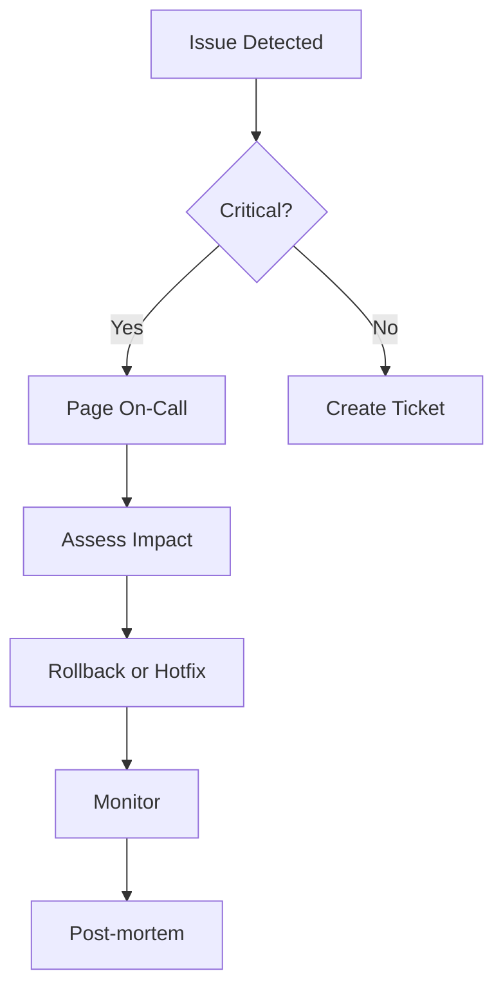

# Troubleshooting

Common issues and solutions for all projects. If you can't find what you're looking for,
check the project-specific documentation or open an issue on GitHub.

## Quick Links

<div class="grid cards" markdown>

-   :material-bug:{ .lg .middle } **Common Issues**

    ---

    Frequently encountered problems and their solutions across all projects.

    [:octicons-arrow-right-24: View issues](common-issues.md)

-   :material-lambda:{ .lg .middle } **Lambda Debugging**

    ---

    Debugging AWS Lambda functions, CloudWatch Logs, and event handling.

    [:octicons-arrow-right-24: Debug Lambda](lambda-debugging.md)

-   :material-terraform:{ .lg .middle } **Terraform Issues**

    ---

    Terraform state, provider, and deployment troubleshooting.

    [:octicons-arrow-right-24: Fix Terraform](terraform-issues.md)

</div>

## Quick Diagnostics

### Check Your Environment

```bash
# Node.js
node --version
npm --version

# Python
python --version
pip --version

# Go
go version

# AWS
aws --version
aws sts get-caller-identity

# Terraform
terraform --version
```

### Common Quick Fixes

| Issue | Quick Fix |
|-------|-----------|
| `command not found` | Check PATH, reinstall tool |
| `permission denied` | Check file permissions, use sudo |
| `connection refused` | Check service is running |
| `401/403 errors` | Check credentials |
| `module not found` | Reinstall dependencies |

## Issue Categories

### By Symptom

| Symptom | Likely Cause | See |
|---------|--------------|-----|
| Build fails | Missing dependencies | [Common Issues](common-issues.md) |
| Tests fail | Environment mismatch | [Common Issues](common-issues.md) |
| Lambda timeout | Code issue | [Lambda Debugging](lambda-debugging.md) |
| Deployment error | State/permission | [Terraform Issues](terraform-issues.md) |

### By Project Type

| Project Type | Common Issues |
|--------------|---------------|
| TypeScript Lambda | ESM imports, type errors |
| Python Lambda | Dependencies, layer issues |
| Go Lambda | Binary compilation |
| Terraform | State conflicts, provider versions |

## Getting Help

### Before Opening an Issue

1. **Search existing issues** - Your problem may already be solved
2. **Check documentation** - Review the relevant docs
3. **Try the quick fixes** - Basic troubleshooting first
4. **Gather information** - Logs, error messages, environment

### Information to Include

```markdown
**Describe the issue**
A clear description of what's happening.

**Steps to reproduce**
1. Step one
2. Step two
3. Error occurs

**Expected behavior**
What should happen.

**Environment**
- OS: [e.g., macOS 14.0]
- Node.js: [e.g., 20.10.0]
- Python: [e.g., 3.12.0]
- Terraform: [e.g., 1.7.0]
- AWS CLI: [e.g., 2.15.0]

**Logs/Error messages**
\`\`\`
Paste error logs here
\`\`\`
```

## Emergency Procedures

### Production Issues



### Rollback Procedures

=== "Lambda"

    ```bash
    # List versions
    aws lambda list-versions-by-function --function-name <name>

    # Update alias to previous version
    aws lambda update-alias \
      --function-name <name> \
      --name prod \
      --function-version <previous-version>
    ```

=== "Terraform"

    ```bash
    # Check state history (if using remote backend)
    terraform state list

    # Revert to previous state
    git checkout HEAD~1 -- *.tf
    terraform plan
    terraform apply
    ```
